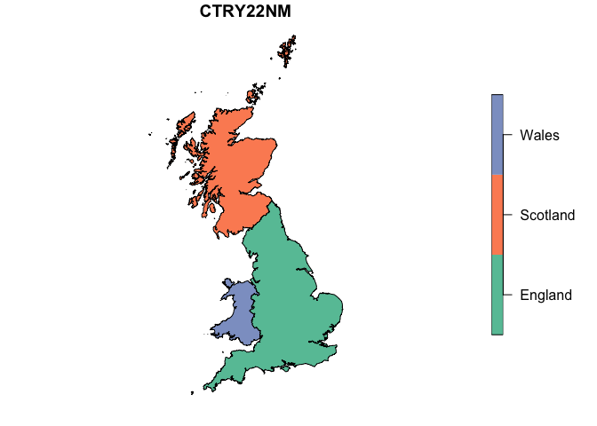

<!-- README.md is generated from README.Rmd. Please edit that file -->

# UKgeogRaphies

<!-- badges: start -->
<!-- badges: end -->

This is still a WIP.

The goal of UKgeogRaphies is to retrieve geospatial data from ONS’
Geoportal and make it usable within R.

So far it provides very limited functionality to download boundaries in
the UK and convert them to `sf` objects.

## Installation

You can install the development version of ukgeographies from
[GitHub](https://github.com/) with:

``` r
# install.packages("devtools")
devtools::install_github("WarwickCIM/ukgeographies")
```

## Example

This is a basic example which shows you how to solve a common problem:

``` r
library(ukgeographies)
## basic example code

countries_2022 <- get_boundaries("countries", 2022, "BUC")

class(countries_2022)
#> [1] "sf"         "tbl_df"     "tbl"        "data.frame"
```

``` r

countries_2022
#> Simple feature collection with 3 features and 11 fields
#> Geometry type: MULTIPOLYGON
#> Dimension:     XY
#> Bounding box:  xmin: -8.649996 ymin: 49.88234 xmax: 1.763706 ymax: 60.86087
#> Geodetic CRS:  WGS 84
#> # A tibble: 3 × 12
#>     FID CTRY22CD  CTRY22NM CTRY22NMW  BNG_E  BNG_N  LONG   LAT   Shape__Area
#>   <int> <chr>     <chr>    <chr>      <int>  <int> <dbl> <dbl>         <dbl>
#> 1     1 E92000001 England  Lloegr    394883 370883 -2.08  53.2 130608597662.
#> 2     2 S92000003 Scotland Yr Alban  277744 700060 -3.97  56.2  78610512179.
#> 3     3 W92000004 Wales    Cymru     263405 242881 -3.99  52.1  20792550547.
#> # ℹ 3 more variables: Shape__Length <dbl>, GlobalID <chr>,
#> #   geometry <MULTIPOLYGON [°]>
```

``` r

plot(countries_2022["CTRY22NM"])
```



You’ll still need to render `README.Rmd` regularly, to keep `README.md`
up-to-date. `devtools::build_readme()` is handy for this.
